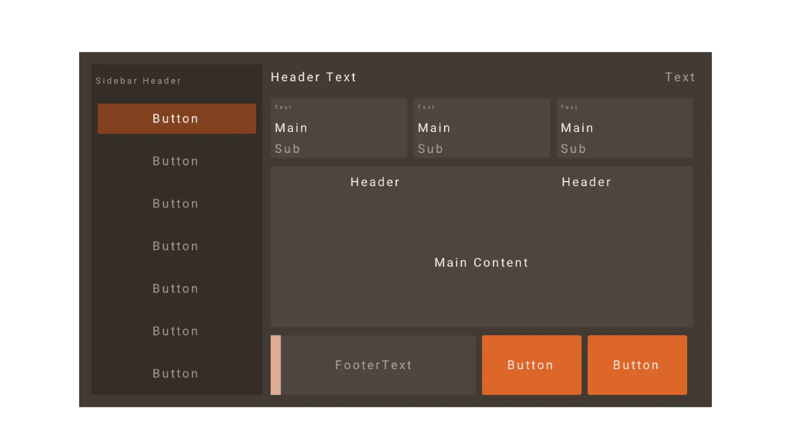

# odin-rlay
General UI layout creator in Odin with support for Raylib. It create cuts to rectangles to form the UI layout. 

## Usage

You can find an example usage in `rlay.odin`. Full documentation will be added in the future.
