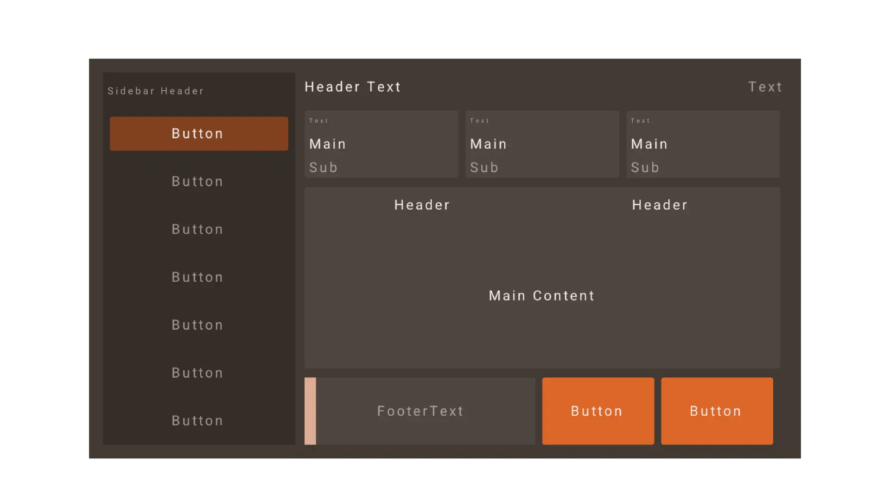

# odin-rlay
General UI layout creator in Odin with support for Raylib. It create cuts to rectangles to form the UI layout. 



## Usage

You can find an example usage in `rlay.odin`. Full documentation will be added in the future.

## Memory

The `cut_multiple_*` / `cut_rect_evenly` procs return a slice. They allocate from
`context.temp_allocator` by default, so the returned slice is valid until the next
`free_all(context.temp_allocator)` — call that once per frame instead of deleting
each slice:

```odin
for !rl.WindowShouldClose() {
	defer free_all(context.temp_allocator)
	...
}
```

Pass an allocator explicitly for a longer lifetime (`rc.cut_multiple_top_percent(&rect, {0.5, 0.5}, context.allocator)`),
and `delete` the result yourself in that case. Every cut also has a non-allocating
`_into` variant that fills a caller supplied buffer:

```odin
rects: [3]rc.Rect
rc.cut_multiple_top_percent_into(&layout, {0.2, 0.6, 0.2}, rects[:])
```
